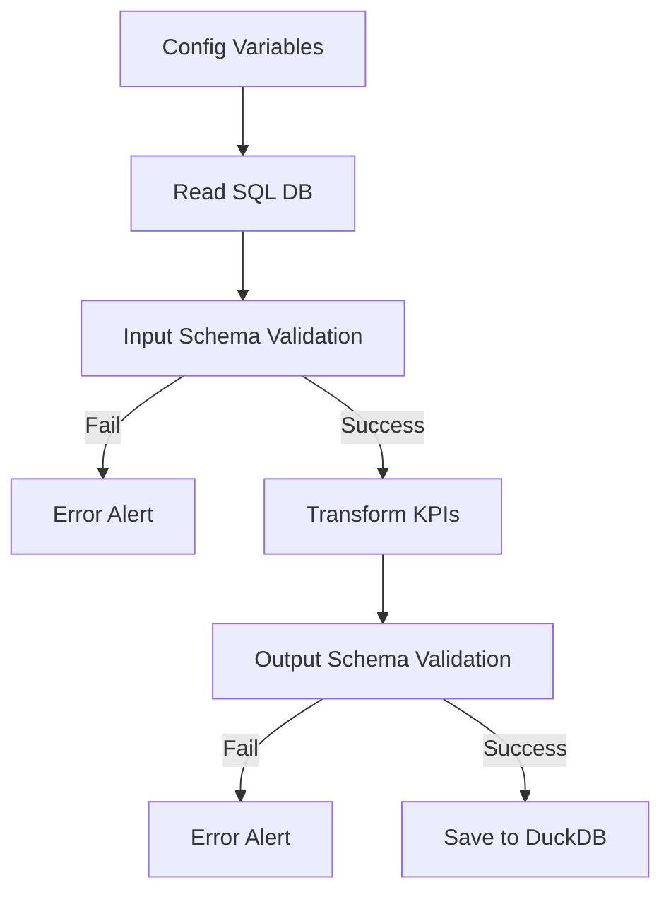

# Portfolio Project

This repository showcases a data quality monitoring project using Pandera, which is derived from Pydantic. The primary goal is to demonstrate how to enforce data contracts and perform data transformations in a reliable and testable manner.

The files in the `app` folder contain the core logic for the ETL (Extract, Transform, Load) process, including schema definitions and transformation functions. This documentation provides an overview of the project, the data contracts, the transformations applied, and also demonstrates my skills to generate clear and well design documentation for users.

## Workflow




# Project Structure

```
portfolio-data-quality-pydantic-and-tdd/
├── app/
│   ├── __init__.py
│   ├── etl.py
│   ├── etl_infer_schema.py
│   ├── read_duckb.py
│   ├── schema.py
│   └── schema_email.py
├── docs/
│   └── index.md
├── pic/
├── sql/
│   ├── create_table_products_bronze.sql
│   ├── create_table_products_bronze_email.sql
│   ├── insert_into_table_bronze.sql
│   ├── insert_into_table_bronze_email.sql
│   └── insert_wrong_values_into_tabela_bronze.sql
├── tests/
│   ├── __init__.py
│   └── test_func_etl.py
├── mkdocs.yml
├── poetry.lock
├── pyproject.toml
└── README.md
```
